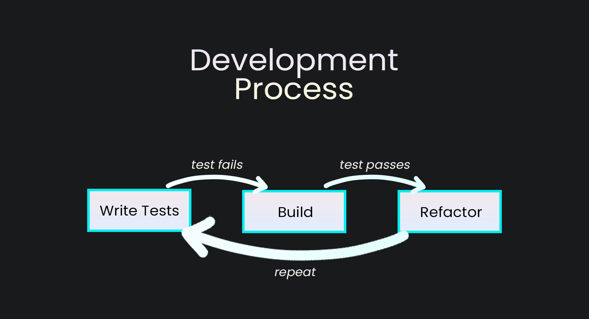

<div id="top"></div>

<div style="text-align:center"></div>

## 1 Introduction

Organize your server building process. List your parts, and use them for
building your server. Ideally, you could use this for your front-end project.

### 1.1 Overview

<p align="center">
  
</p>

- <ins>Back-end</ins>: Django, DRF
- <ins>Deployed on</ins>: Amazon EC2
- <ins>Testing</ins>: Django Test
- <ins>Containerization</ins>: Docker

---


## 2 Demo

If you don't want to build it yourself and try it beforehand, check:

- Swagger Documentation - [Docs](http://ec2-44-203-37-53.compute-1.amazonaws.com/api/docs/)
- Download the Documentation - [Schema](http://ec2-44-203-37-53.compute-1.amazonaws.com/api/schema/)
- Admin Page - [Django Admin](http://ec2-44-203-37-53.compute-1.amazonaws.com/admin/)

> If the EC2 instance is down OR if you would like the
> credentials for the admin page, please email me.


### 2.1 Examples


1. Gaming Server:
   - Processor: Intel Core i9-11900K
   - Graphics Card: NVIDIA GeForce RTX 3090
   - RAM: 32GB DDR4
   - Storage: 1TB NVMe SSD
2. Video Editing Server:
   - Processor: AMD Ryzen 9 5950X
   - Graphics Card: NVIDIA GeForce RTX 3080
   - RAM: 64GB DDR4
   - Storage: 2TB NVMe SSD
3. Machine Learning Server:
   - Processor: Intel Xeon Gold 6248R
   - Graphics Card: NVIDIA A100 Tensor Core GPU
   - RAM: 128GB DDR4
   - Storage: 4TB NVMe SSD


## 3 Build & Test & Deploy


### 3.1 Crete your own super user

```bash
docker-compose run --rm app sh -c "python manage.py createsuperuser"
```

### 3.2 Run Linter

```bash
docker-compose run --rm app sh -c "flake8"
```


### 3.3 Run the tests

```bash
docker-compose run --rm app sh -c "python manage.py test"
```


### 3.4 Build the container

```bash
docker-compose build
```


### 3.5 Run the container

```bash
docker compose run
```

### 3.6 Deployment Notes

Convert the `.env.sample` to `.env` and change the values.


## 4 Arcitecture


<p align="center">
  
</p>


## 5 Test-Driven Development

<p align="center">
  
</p>

The project was built using test-driven development, the next subtitles you will
see are going to be in the process mentioned above. There are a total of 62
tests present for this project.

---

### 5.1 Implementing wait_for_db command:

#### test_wait_for_db_ready:

Tests if it waits for db to be ready.

#### test_wait_for_db_delay

Tests to see what happens when the db is not ready.

The first 2 times we call the mocked method an raise Psycopg2Error. The next 3
times we raise OperationalError. This is because of the starting procedure for
the Postgres database. The constant values may change.

### Run the tests:

```bash
docker-compose run --rm app sh -c "python manage.py test && flake8"
```

### Result:

> Fail 2 tests.

### Building the command:

```python
class Command(BaseCommand):

    def handle(self, *args, **options):
        """Entrypoint for command."""
        self.stdout.write('Waiting for database...')
        db_up = False
        while db_up is False:
            try:
                self.check(databases=['default'])
                db_up = True
            except (Psycopg2OpError, OperationalError):
                self.stdout.write('Database unavailable, waiting 1 second...')
                time.sleep(1)

        self.stdout.write(self.style.SUCCESS('Database available!'))
```


The handle() method is the entry point for the command.

The command then sets a variable db_up to False and enters into a while loop
that keeps running until the value of db_up becomes True. Inside the loop, the
command tries to check the availability of the default database using the
check() method of the Django database backend.


If the database is unavailable, the command catches the Psycopg2OpError or
OperationalError exception, prints a message to the console indicating that the
database is unavailable, and waits for 1 second before retrying.


Once the database is available, the check() method returns without raising any
exceptions, and the loop is exited. Finally, the command prints a message to the
console indicating that the database is available.

### Run the tests:

Ran 2 tests OK.

---

### 5.2 Implementing User Model:

#### test_create_user_with_email_successful:

The objects.create_user() method is called on the user model
to create a new user with the provided email and password.


The test then uses two assertions to check the created user's email and
password. The first assertion checks whether the user's email is equal to the
email passed to the create_user() method. The second assertion checks whether
the user's password can be validated with the password passed to the
create_user() method using the check_password() method.


If both assertions pass, it means that the user model was created successfully
with the correct email and password, and the password can be validated. If
either assertion fails, it means that there is an error in the user model
creation or password validation process.


### Run the tests:

```bash
docker-compose run --rm app sh -c "python manage.py test && flake8"
```

### Result:

> Failed 1 test.


### Building the User model:

```python
class User(AbstractBaseUser, PermissionsMixin):
    """User in the system."""

    email = models.EmailField(max_length=255, unique=True)
    name = models.CharField(max_length=255)
    is_active = models.BooleanField(default=True)
    is_staff = models.BooleanField(default=False)

    objects = UserManager()

    USERNAME_FIELD = "email"
```

The USERNAME_FIELD is used for authentication.


### User Model:

| Field | Parameters | Type |
|-------|------------|------|
| email | max_length=255, unique=True | EmailField |
| name | max_length=255 | CharField |
| is_active | default=True | BooleanField |
| is_staff | default=False | BooleanField |
| USERNAME_FIELD | "email" | CharField |

### Run the tests:

> Ran 3 tests OK.


### Building the User Manager:

```python
class UserManager(BaseUserManager):
    """Manager for users."""

    def create_user(self, email, password=None, **extra_fields):
        """Create, save and return a new user."""
        user = self.model(email=email, **extra_fields)
        user.set_password(password)
        user.save(using=self._db)

        return user
```

UserManager class extends the BaseUserManager class provided by Django. The
create_user method is defined to create a new user object, set the email and
password, and save it to the database.


The set_password method is a built-in method provided by Django's
AbstractBaseUser class, which this custom user model inherits from. It is used
to hash and save the user's password securely.


The using parameter in the user.save method specifies the database to use, which
can be useful if your project is using multiple databases.


This custom user manager can be used in conjunction with a custom user model by
specifying AUTH_USER_MODEL in the project's settings file. By default, Django
uses its own built-in user model, but customizing it with a custom user manager
and model can provide more flexibility and control over user authentication and
authorization.

#### Settings.py:

Setting Auth_User_Model configuration.

```python
AUTH_USER_MODEL = "core.User"
```


---

### 5.3 Add feature to normalize user email:

#### test_create_user_with_email_successful:

Email normalization means converting the email address to a consistent format.
In this case, the email addresses are being converted to lowercase format.


The test contains a list of sample emails that are in different formats but
should all be normalized to the same format: lowercase with the domain name in
lowercase as well. The test iterates over this list and for each email, creates
a new user object using the custom user manager's create_user method with the
given email and a sample password.


After creating the user object, the test checks whether the email of the user
object is equal to the expected normalized email. If it is, the test passes;
otherwise, it fails.


By testing email normalization, this test ensures that the custom user manager
is correctly normalizing email addresses for new users, which can help prevent
issues with case sensitivity and inconsistent email formats.


### Run the tests:

```bash
docker-compose run --rm app sh -c "python manage.py test && flake8"
```

### Result:

> Failed 1 test.


### Add the normalize_email functionality inside create_user method:


```python
def create_user(self, email, password=None, **extra_fields):
    """Create, save and return a new user."""
    user = self.model(email=self.normalize_email(email), **extra_fields)
    user.set_password(password)
    user.save(using=self._db)

    return user
```

### Run the tests:

> Ran 4 tests OK.

---

### 5.4 Add feature to require email address:

#### test_new_user_without_email_raises_error:

The test creates a user object using the custom user manager's create_user
method with an empty string as the email and a sample password.


Since the email is empty, the user creation should fail and raise a ValueError.
The test uses the assertRaises method from the unittest module to check whether
a ValueError is indeed raised when creating the user with an empty email. If a
ValueError is raised, the test passes; otherwise, it fails.


This test is important because email addresses are typically used as the primary
identifier for users, so it's essential to ensure that creating a user without
an email address fails with an appropriate error message.


### Run the tests:

```bash
docker-compose run --rm app sh -c "python manage.py test && flake8"
```


### Result:

> Failed 1 test.


## Add the functionality inside the UserManager:


```python
class UserManager(BaseUserManager):
    """Manager for users."""

    def create_user(self, email, password=None, **extra_fields):
        """Create, save and return a new user."""
        if not email:
            raise ValueError('User must have an email address.')
        user = self.model(email=self.normalize_email(email), **extra_fields)
        user.set_password(password)
        user.save(using=self._db)

        return user
```

If email is not entered ValueError will be outputted.


### Run the tests:

> Ran 5 tests OK.

---

### 5.5 Add superuser functionality:

#### test_create_superuser:

This test checks whether the custom user manager's create_superuser method is
correctly creating a superuser with the is_superuser and is_staff flags set to
True.


The test creates a new user object using the create_superuser method provided by
the custom user manager, passing in an email and password. This method should
create a new user object with the is_superuser and is_staff fields set to True,
indicating that the user has superuser privileges.


After creating the superuser object, the test checks whether the is_superuser
and is_staff fields are both set to True. If they are, the test passes;
otherwise, it fails.


This test is important to ensure that the custom user manager's create_superuser
method is correctly setting the appropriate privileges for superusers, which can
have additional permissions and access to certain parts of the system that
regular users do not have.

### Run the tests:

```bash
docker-compose run --rm app sh -c "python manage.py test && flake8"
```


### Result:

> Failed 1 test.

## Add the a new method inside the UserManager:

```python
def create_superuser(self, email, password):
    """Create and return a new superuser."""
    user = self.create_user(email, password)
    user.is_staff = True
    user.is_superuser = True
    user.save(using=self._db)

    return user
```


### Run the tests:

> Ran 4 tests OK.


---

### 5.6 Test the Django Admin:

### setUP:

The setUp method is used to create a superuser and a regular user using the
custom user manager's create_superuser and create_user methods, respectively.
The Client object is also created, and the force_login method is called on it
with the superuser object to log in the user.

### test_users_lists:

The test_users_lists method is then called to test whether the list of users is
displayed correctly in the admin interface. It does this by first getting the
URL for the user change list page using the reverse function and the admin
site's core_user_changelist view name.


The get method is then called on the Client object to retrieve the page at the
given URL. The resulting response object, res, is then checked using the
assertContains method to ensure that it contains the name and email address of
the regular user created in the setUp method. If the user's name and email
address are present in the response, the test passes; otherwise, it fails.


This test is important to ensure that the Django admin interface is correctly
displaying the list of users and their details, which can be helpful for
administrators to manage user accounts and perform various tasks related to user
management.


### Run the tests:

```bash
docker-compose run --rm app sh -c "python manage.py test && flake8"
```

### Result:

> Failed 2 tests.

---

### 5.6 Add admin feature that lists users:

```python
class UserAdmin(BaseUserAdmin):
    """Define the admin pages for users."""
    ordering = ['id']
    list_display = ['email', 'name']


admin.site.register(models.User, UserAdmin)
```

Note: UserAdmin imported as BaseUserAdmin


### Run the tests:

> Ran 6 tests OK.


---

### 5.7 Test the Django Admin:

### test_edit_user_page:

The test uses the reverse function to generate the URL for the edit user page
for the regular user created in the setUp method. The reverse function takes in
the URL pattern name for the view and any arguments required to generate the
URL. In this case, the pattern name is core_user_change, and the user's ID is
passed as an argument.


The get method is then called on the Client object to retrieve the page at the
generated URL. The resulting response object, res, is then checked using the
assertEqual method to ensure that the HTTP status code is 200, indicating that
the page was successfully loaded. If the status code is 200, the test passes;
otherwise, it fails.


This test is important to ensure that the edit user page is working as expected
in the Django admin interface. It checks whether the page can be loaded
correctly for a regular user and that there are no issues or errors with the
page's functionality. This can help ensure that administrators can manage user
accounts smoothly and efficiently.


### Run the tests:

```bash
docker-compose run --rm app sh -c "python manage.py test && flake8"
```

### Result:

> Failed 2 tests.

### Add support modifying users on the admin page:

```python
class UserAdmin(BaseUserAdmin):
    """Define the admin pages for users."""
    ordering = ['id']
    list_display = ['email', 'name']
    fieldsets = (
        (None, {'fields': ('email', 'password')}),
        (_('Personal Info'), {'fields': ('name',)}),
        (
            _('Permissions'),
            {
                'fields': (
                    'is_active',
                    'is_staff',
                    'is_superuser',
                )
            }
        ),
        (_('Important dates'), {'fields': ('last_login',)}),
    )
    readonly_fields = ['last_login']


admin.site.register(models.User, UserAdmin)
```

### Run the tests:

> Ran 9 tests OK.

---

### 5.8 Building the User API

### test_create_user_success:

Tests that a user can be created successfully by sending a POST request to the CREATE_USER_URL endpoint with a payload containing the email, password, and
 name of the new user. The method then asserts that the response status code is
 HTTP_201_CREATED, checks that the password is hashed correctly using the
 check_password method of the user object, and verifies that the password is not
 included in the response data.

### test_user_with_email_exists_error:

Tests that an error is returned if a user with the same email address already
exists. It first creates a user with the same email using the create_user helper
function and then sends a POST request to the CREATE_USER_URL endpoint with the
same email. The method asserts that the response status code is
HTTP_400_BAD_REQUEST.

### test_password_too_short_error:

Tests that an error is returned if the password is less than 5 characters. It
sends a POST request to the CREATE_USER_URL endpoint with a payload containing
an email, a password that is less than 5 characters, and a name. The method
asserts that the response status code is HTTP_400_BAD_REQUEST and verifies that
no user with the email exists in the database.

### Run the tests:

```bash
docker-compose run --rm app sh -c "python manage.py test && flake8"
```

### Result:

> Failed 1 test.


### Building the serializers.py:

```python
class UserSerializer(serializers.ModelSerializer):
    """Serializer for the user object."""

    class Meta:
        model = get_user_model()
        fields = ["email", "password", "name"]
        extra_kwargs = {"password": {"write_only": True, "min_length": 5}}

    def create(self, validated_data):
        """Create and return a user with encrypted password."""
        return get_user_model().objects.create_user(**validated_data)
```

### Build the views.py:

```python
class CreateUserView(generics.CreateAPIView):
    """Create a new user in the system."""
    serializer_class = UserSerializer
```

### Run the tests:

> Ran 12 tests OK.


---

### 5.9 Build User Authenticaion:


The test_password_too_short_error method tests that an error is returned if the
password is less than 5 characters. It sends a POST request to the
CREATE_USER_URL endpoint with a payload containing an email, a password that is
less than 5 characters, and a name. The method asserts that the response status
code is HTTP_400_BAD_REQUEST and verifies that no user with the email exists in
the database.


The test_create_token_for_user method tests that a token is generated for a user
with valid credentials. It first creates a new user using the create_user helper
function and then sends a POST request to the TOKEN_URL endpoint with the email
and password of the user. The method asserts that the response data contains a
token and that the response status code is HTTP_200_OK.


The test_create_token_bad_credentials method tests that an error is returned if
the credentials are invalid. It creates a user with a password using the
create_user helper function and then sends a POST request to the TOKEN_URL
endpoint with an incorrect password. The method asserts that the response data
does not contain a token and that the response status code is
HTTP_400_BAD_REQUEST.


The test_create_token_email_not_found method tests that an error is returned if
the user with the given email is not found. It sends a POST request to the
TOKEN_URL endpoint with an email that does not exist in the database. The method
asserts that the response data does not contain a token and that the response
status code is HTTP_400_BAD_REQUEST.


The test_create_token_blank_password method tests that an error is returned if
the password is blank. It sends a POST request to the TOKEN_URL endpoint with an
email and a blank password. The method asserts that the response data does not
contain a token and that the response status code is HTTP_400_BAD_REQUEST.


### Run the tests:

```bash
docker-compose run --rm app sh -c "python manage.py test && flake8"
```

### Result:

> Failed 4 tests.


### Implement Token API:

```python
class AuthTokenSerializer(serializers.Serializer):
    """Serializer for the user auth token."""
    email = serializers.EmailField()
    password = serializers.CharField(
        style={'input_type': 'password'},
        trim_whitespace=False,
    )

    def validate(self, attrs):
        """Validate and authenticate the user."""
        email = attrs.get('email')
        password = attrs.get('password')
        user = authenticate(
            request=self.context.get('request'),
            username=email,
            password=password,
        )
        if not user:
            msg = _('Unable to authenticate with provided credentials.')
            raise serializers.ValidationError(msg, code='authorization')

        attrs['user'] = user
        return attrs
```


### Run the tests:

> Ran 14 tests OK.


---

### 5.10 Managing User API


### Testing User API Endpoints:


The tests are using the Django TestCase class and the APIClient class from Django Rest Framework to simulate HTTP requests and responses. The reverse function is used to generate URLs for the User API endpoints.

The ME_URL constant is defined as the URL for retrieving and updating the user profile.

The create_user function is a helper function that creates a new user using the get_user_model function provided by Django.

The test_retrieve_user_unauthorized method tests that authentication is required to retrieve the user profile. It sends a GET request to the ME_URL endpoint without authentication and asserts that the response status code is HTTP_401_UNAUTHORIZED.

The PrivateUserApiTests class inherits from TestCase and contains the test methods for the User API endpoints that require authentication.

The setUp method is called before each test method and creates a new user using the create_user helper function, an instance of APIClient, and forces authentication for that client using the force_authenticate method.

The test_retrieve_profile_success method tests that a logged-in user can retrieve their own profile information. It sends a GET request to the ME_URL endpoint with the authenticated client and asserts that the response status code is HTTP_200_OK and the response data contains the user's name and email.

The test_post_me_not_allowed method tests that the POST method is not allowed for the ME_URL endpoint. It sends a POST request to the ME_URL endpoint with an empty payload and asserts that the response status code is HTTP_405_METHOD_NOT_ALLOWED.

The test_update_user_profile method tests that a logged-in user can update their own profile information. It sends a PATCH request to the ME_URL endpoint with a payload containing the updated name and password. The method asserts that the user's name and password have been updated in the database, that the password is hashed correctly using the check_password method, and that the response status code is HTTP_200_OK.


## Run the tests:

```bash
docker-compose run --rm app sh -c "python manage.py test && flake8"
```

### Result:

> Failed 2 tests.


### Implenting the User API Management

### Inside serializers.py file:

```python
    def update(self, instance, validated_data):
        """Update and return user."""
        password = validated_data.pop('password', None)
        user = super().update(instance, validated_data)

        if password:
            user.set_password(password)
            user.save()

        return user

```

### Implement the view:

```python
class ManageUserView(generics.RetrieveUpdateAPIView):
    """Manage the authenticated user."""
    serializer_class = UserSerializer
    authentication_classes = [authentication.TokenAuthentication]
    permission_classes = [permissions.IsAuthenticated]

    def get_object(self):
        """Retrieve and return the authenticated user."""
        return self.request.user
```

### Run the tests:

> Ran 20 tests OK.


### 5.11 Server API

## Building the Server Model

### test_create_server:

This test is designed to test the creation of a new server instance in a Django
project.


The test uses the Django TestCase class and the get_user_model function to
create a new user and the Decimal class from Python's built-in decimal module to
create a decimal value for the server price.


The Server model is imported from the project's models.py file and is used to
create a new server instance with the specified attributes.


The assertEqual method is used to assert that the string representation of the
server instance is equal to its title attribute.


The test verifies that the server instance can be created successfully and its
string representation is correct.


## Run the tests:

```bash
docker-compose run --rm app sh -c "python manage.py test && flake8"
```

### Result:

> Failed 2 tests.


### Implementing the Model Class:

```python
class Server(models.Model):
    """Server object."""

    user = models.ForeignKey(
        settings.AUTH_USER_MODEL,
        on_delete=models.CASCADE,
    )
    title = models.CharField(max_length=255)
    description = models.TextField(blank=True)
    price = models.DecimalField(max_digits=5, decimal_places=2)
    link = models.CharField(max_length=255, blank=True)

    def __str__(self):
        return self.title
```


### Run the tests:

> Ran 21 tests OK.


---

### 5.12 Listing Servers

These tests are related to the Server API endpoints in a Django project and are
testing various features of those endpoints.


The tests are using the Django TestCase class and the APIClient class from
Django Rest Framework to simulate HTTP requests and responses. The reverse
function is used to generate URLs for the Server API endpoints.


The Decimal class from Python's built-in decimal module is used to create
decimal values for the server price.


The Server model is imported from the project's models.py file, and the
ServerSerializer is imported from the project's serializers.py file.


The SERVERS_URL constant is defined as the URL for retrieving a list of servers.


The create_server function is a helper function that creates a new server
instance with the specified attributes.


The PublicServerAPITests class inherits from TestCase and contains the test
methods for the Server API endpoints that do not require authentication.


The setUp method is called before each test method and creates an instance of
APIClient.


The test_auth_required method tests that authentication is required to retrieve
a list of servers. It sends a GET request to the SERVERS_URL endpoint without
authentication and asserts that the response status code is
HTTP_401_UNAUTHORIZED.


The PrivateServerAPITests class inherits from TestCase and contains the test
methods for the Server API endpoints that require authentication.


The setUp method is called before each test method and creates an instance of
APIClient, a new user, and forces authentication for that client using the
force_authenticate method.


The test_retrieve_servers method tests that a logged-in user can retrieve a list
of servers. It creates two server instances using the create_server helper
function and sends a GET request to the SERVERS_URL endpoint with the
authenticated client. The method asserts that the response status code is
HTTP_200_OK and the response data contains a serialized representation of the
server instances.


The test_server_list_limited_to_user method tests that the list of servers is
limited to the authenticated user. It creates two server instances, one for the
authenticated user and another for a different user, using the create_server
helper function and sends a GET request to the SERVERS_URL endpoint with the
authenticated client. The method asserts that the response status code is
HTTP_200_OK and the response data contains only the serialized representation of
the server instance created by the authenticated user.


## Run the tests:

```bash
docker-compose run --rm app sh -c "python manage.py test && flake8"
```

### Result:

> Failed 3 tests.


### Implementing Server Listing API:

Building the serializer:


```python
from rest_framework import serializers

from core.models import Server


class ServerSerializer(serializers.ModelSerializer):
    """Serializer for servers."""

    class Meta:
        model = Server
        fields = ['id', 'title', 'price', 'link']
        read_only_fields = ['id']

```

Building the view:

```python
from rest_framework import viewsets
from rest_framework.authentication import TokenAuthentication
from rest_framework.permissions import IsAuthenticated

from core.models import Server
from server import serializers


class ServerViewSet(viewsets.ModelViewSet):
    """View for manage server APIs."""
    serializer_class = serializers.ServerSerializer
    queryset = Server.objects.all()
    authentication_classes = [TokenAuthentication]
    permission_classes = [IsAuthenticated]

    def get_queryset(self):
        """Retrieve servers for authenticated user."""
        return self.queryset.filter(user=self.request.user).order_by('-id')
```


### Run the tests:

> Ran 31 tests OK.

---

### 5.13 Tag API

## Building the Tag Model

### test_create_tag:

The Tag model is imported from the project's models.py file and is used to
create a new tag instance with the specified attributes.

The assertEqual method is used to assert that the string representation of the
tag instance is equal to its name attribute.

The test verifies that the tag instance can be created successfully and its
string representation is correct.


## Run the tests:

```bash
docker-compose run --rm app sh -c "python manage.py test && flake8"
```

### Result:

> Failed 3 tests.


### Add the tag model:

```python
class Tag(models.Model):
    """Tag for filtering servers."""

    name = models.CharField(max_length=255)
    user = models.ForeignKey(
        settings.AUTH_USER_MODEL,
        on_delete=models.CASCADE,
    )

    def __str__(self):
        return self.name
```

### Run the tests:

> Ran 32 tests OK.

---

### 5.14 Listing Tags

## Unauthenticated API requests:

The test uses the Django TestCase class and the APIClient class from Django Rest
Framework to simulate HTTP requests and responses. The TAGS_URL constant is
defined as the URL for retrieving a list of tags.

The setUp method is called before each test method and creates an instance of
APIClient.

The test_auth_required method tests that authentication is required to retrieve
a list of tags. It sends a GET request to the TAGS_URL endpoint without
authentication and asserts that the response status code is
HTTP_401_UNAUTHORIZED.

The test verifies that an unauthenticated user cannot access the tags API and
receives a 401 Unauthorized response.


## Authenticated API requests:

The setUp method creates an instance of APIClient, a new user using the
create_user helper function, and forces authentication for that client using the
force_authenticate method.

The first test method, test_retrieve_tags, tests that a logged-in user can
retrieve a list of tags. It creates two tag instances using the
Tag.objects.create method and sends a GET request to the TAGS_URL endpoint with
the authenticated client. The method asserts that the response status code is
HTTP_200_OK and the response data contains a serialized representation of the
tag instances.

The second test method, test_tags_limited_to_user, tests that the list of tags
is limited to the authenticated user. It creates two tag instances, one for the
authenticated user and another for a different user, using the
Tag.objects.create method and sends a GET request to the TAGS_URL endpoint with
the authenticated client. The method asserts that the response status code is
HTTP_200_OK and the response data contains only the serialized representation of
the tag instance created by the authenticated user.


## Run the tests:

```bash
docker-compose run --rm app sh -c "python manage.py test && flake8"
```

### Result:

> Failed 4 tests.


## Implement Tag Listing

Serializer:

```python
class TagSerializer(serializers.ModelSerializer):
    """Serializer for tags."""

    class Meta:
        model = Tag
        fields = ['id', 'name']
        read_only_fields = ['id']
```

TagViewSet:

```python
class TagViewSet(mixins.ListModelMixin, viewsets.GenericViewSet):
    """Manage tags in the database."""
    serializer_class = serializers.TagSerializer
    queryset = Tag.objects.all()
    authentication_classes = [TokenAuthentication]
    permission_classes = [IsAuthenticated]

    def get_queryset(self):
        """Filter queryset to authenticated user."""
        return self.queryset.filter(user=self.request.user).order_by('-name')
```


### Run the tests:

> Ran 32 tests OK.


---

### 5.15 Components API

### Building the Model

### test_create_component:

The Component model is imported from the project's models.py file and is used to
create a new component instance with the specified attributes.

The assertEqual method is used to assert that the string representation of the
component instance is equal to its name attribute.

The test verifies that the component instance can be created successfully and
its string representation is correct.

## Run the tests:

```bash
docker-compose run --rm app sh -c "python manage.py test && flake8"
```

### Result:

> Failed 1 test.


### Component model:

```python
class Component(models.Model):
    """Component for servers."""

    name = models.CharField(max_length=255)
    user = models.ForeignKey(
        settings.AUTH_USER_MODEL,
        on_delete=models.CASCADE,
    )

    def __str__(self):
        return self.name
```

### Run the tests:

> Ran 34 tests OK.

---

### 5.16 Image API

### test_server_file_name_uuid:

The test uses the Django TestCase class and the patch decorator from the
unittest.mock library to mock the uuid.uuid4 function. The uuid value is set to
"test-uuid".


The server_image_file_path function is imported from the models.py file and is
used to generate a file path for the image with the specified name.


The assertEqual method is used to assert that the generated file path is equal
to the expected file path, which is constructed using the uuid value and the
image file extension.


The test verifies that the server_image_file_path function can generate a
correct file path for a server image given a UUID and an image file name.

## Run the tests:

```bash
docker-compose run --rm app sh -c "python manage.py test && flake8"
```

### Result:

> Failed 1 test.

### Add image file path generator:

```python
def server_image_file_path(instance, filename):
    """Generate file path for new server image."""
    ext = os.path.splitext(filename)[1]
    filename = f"{uuid.uuid4()}{ext}"

    return os.path.join("uploads", "server", filename)
```

### Update the model:

```python
class Server(models.Model):
    """Server object."""

    user = models.ForeignKey(
        settings.AUTH_USER_MODEL,
        on_delete=models.CASCADE,
    )
    title = models.CharField(max_length=255)
    description = models.TextField(blank=True)
    price = models.DecimalField(max_digits=10, decimal_places=2)
    link = models.CharField(max_length=255, blank=True)
    tags = models.ManyToManyField("Tag")
    components = models.ManyToManyField("Component")
    image = models.ImageField(null=True, upload_to=server_image_file_path)
```

### Run the tests:

> Ran 50 tests OK.

## 6. Future Work

- Build a front-end.

<p align="right">(<a href="#top">back to top</a>)</p>

## 7. Contributing

If you would like to add any extra features to the optimisation simulation, feel free to fork and create a pull request. Thank you!

1. Fork the Project
2. Create your Feature Branch (`git checkout -b feature/AmazingFeature`)
3. Commit your Changes (`git commit -m 'Add some AmazingFeature'`)
4. Push to the Branch (`git push origin feature/AmazingFeature`)
5. Open a Pull Request

<p align="right">(<a href="#top">back to top</a>)</p>


<!-- CONTACT -->
## 8. Contact

Erol Gelbul - [Website](http://www.erolgelbul.com)

Project Link: [BuildMate](https://github.com/ErolGelbul/buildmate)

<p align="right">(<a href="#top">back to top</a>)</p>

